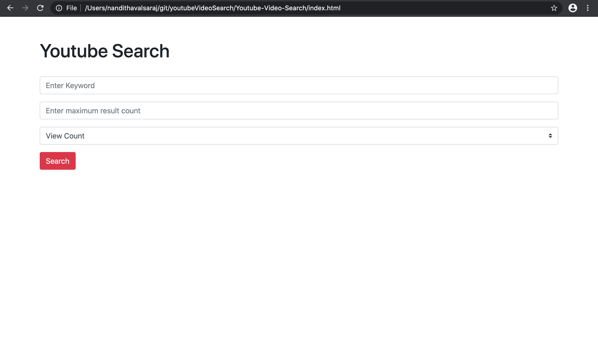

# Youtube Video Search
 Youtube Video Search with query keyword

In this project we work with youtube data api v3 using bootstrap and jQuery.

For gaining access to the app the user would have to generate google api key. 

This project as for now can be run directly from index.html file.

Enter in the query keyword and other information needed as per screen below and click submit to get results.

